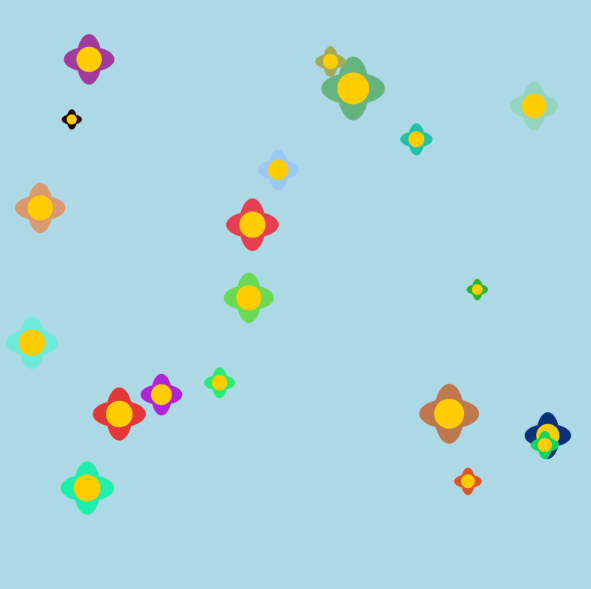

# Individual part - Ziyan Xu - SID: 550464763

## Drive Part
Perlin Noise

## Introduction
Building on the group's code framework, I added a cover design and basic interaction features, while implementing growth animations for the trees. Their growth speed is controlled by Perlin Noise, resulting in more natural and smooth dynamic effects.

## Image Animation
Building on the group's code, I applied the **Transformations** techniques learned in Week 9—using methods like `translate()`, `rotate()`, and `scale()`—to bring the trees to life with animation effects. I also adjusted the `frameCount` parameter to refine the animation (I’m not entirely certain about its exact function, so feel free to correct this part as needed). Additionally, I incorporated methods from Perlin Noise (covered in Week 10), referencing elements such as `for` loops and relevant variables from the tutorial to design my code. 

## References & Inspiration
The flickering and gradually shrinking small flowers inspired me to come up with the idea of making the trees grow and shrink progressively. 
(https://p5js.org/tutorials/data-structure-garden/)

## Technical Explanation
I watched three tutorial videos on YouTube—*Perlin Noise in p5.js* and *Perlin Noise in Two Dimensions*。 Perlin Noise*—to deepen my understanding of the concept before proceeding with this project.
(https://youtu.be/Qf4dIN99e2w?si=wSmaXiwoSNXTtboR)
(https://youtu.be/ikwNrFvnL3g?si=hckscPQlTFJCpJBz)

I drew inspiration from the snake game example in p5.js and applied, as well as integrated, similar interaction logic into my user input functionality.
(https://p5js.org/tutorials/repeating-with-loops/)