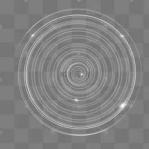

# Individual Part：Hengyi-Dan- SID：540824395
IDEA9103_Creative coding major project

## Drive Part
Audio.

## Instructions
Click the four different buttons with your mouse to hear four different songs，and the background graphics will change in sync wiht the audio. There are four seasons in total: spring, summer, autumn, and winter.

## Image Animated
Based on the original image, I kept the tree from the source photo while animating the background to reduce visual clutter. For instance, I animated the summer sun and added a halo effect to simulate lighting.The overall music playback resembles the effect of a music box.

## References Inspiration

When creating the winter halo effect, I referenced the shape and imagery of halos to simulate their appearence. Based on the characteristics of audio animation, I aimed to convey a flickering quality.

## Technical explanation
First， the code based on my creation on the audio tutorial from week 11 of the course. I create two variables: song and analyser.Then,I added four different songs and buttons, all of which were implemented using functions.At the same time, I made some changes to the play function inside the function,adding a stop element. This ensures that when one song is playing, the other three songs also play simultaneously. As a result, using a single button will only play one song at a time.
Finally, I created audio shapes for the graphics, such as circles, triangles, and halos, modifying their coordinates in combination with RMS elements to achieve the desired effects.