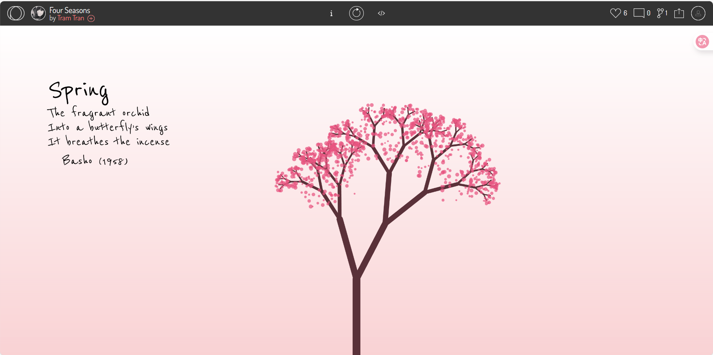

# Individual part_Qiyue Ji_SID:550181745

Qiyue Ji | SID: 50181745 | unikey: qiji0008 | Individual component for creative coding major projects

## 1. Instruction

### a). Seasonal Animation

- The animation cycles through the four seasons: Spring, Summer, Autumn, and Winter.

- Each season is displayed for approximately 2 seconds, creating a smooth transition from one to the next.

### b). Random Background and Moving Circles

- Once the four seasons finish, a floating tree appears against a dynamic background of randomly positioned circles.

- The circles update their positions every 0.3 seconds, and the background color changes every 3 seconds, creating a lively and ever-changing visual effect.

## 2. Drive Part: Details of my individual approach to animating the group code

### a). My Animation type: Time-Based Animation

### b). Animation Properties

- The seasons change in sequence (spring → summer → autumn → winter).

- Randomized floating circles with random background after seasons.

### c). My unique contribution compared to group members:

- Implemented timer-controlled sequential seasonal transitions using setInterval().

- Designed and coded the floating tree with randomly moving circles stage after the seasons.

## 3.References to inspiration for animating

I was inspired by the OpenProcessing sketch “Four Seasons”, which repeatedly refreshes different tree forms to represent the four seasons. This piece influenced my work in the following ways:

- Inspired by this, I implemented automatic seasonal transitions every few seconds in my animation.

In addition to the knowledge learned in class,I also watched the YouTube tutorial “Random Walker in p5.js”, which helped me better understand the concept and guided the implementation of randomly moving circles with changing position, size, and color.

## 4.Technical explanation

### a). setInterval()

This part of my animation is built on the Week 5 “automate a periodic task” concept.

- I used setInterval() to trigger actions repeatedly at fixed time intervals.

- A timer is set to run every 2 seconds, which updates the counter that determines the current season.

- When the timer activates, the animation automatically switches to the next season in the sequence.

### b). Random Circle 

The random circle background system is based on the Week 6 “random walker” concept.

- Randomizing position, size, and color each update

- Faster update interval (0.3s) for a lively effect

Reference Links:

[Four Seasons](https://openprocessing.org/sketch/586948/?utm_source=chatgpt.com)

[Project_LSolomonExtra](https://openprocessing.org/sketch/478169)

[Link Text](https://p5js.org/reference/p5/strokeWeight/)

[Link Text](https://p5js.org/reference/p5/frameCount/)

[Link Text](https://p5js.org/reference/#/p5/setInterval)

